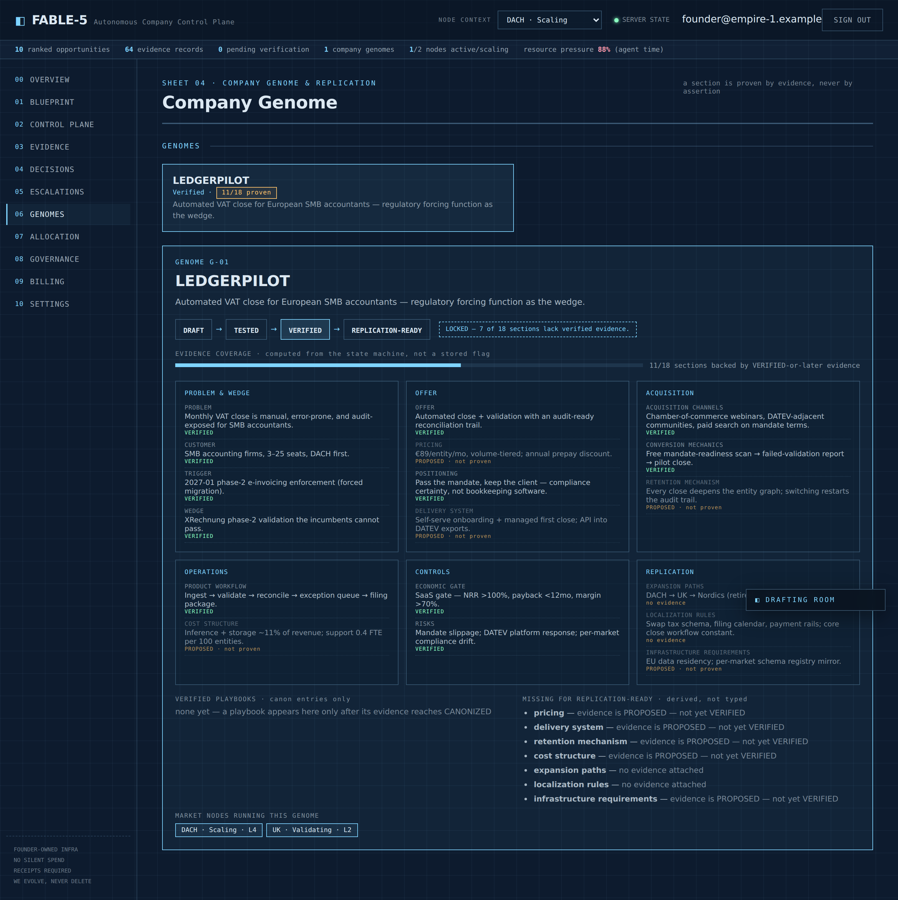

# FABLE-5 — The Governance Layer for AI-Native Companies


An evidence-governed company control plane, built by **Empire-1**. Work does not count
because an agent says it is done, and money does not move because an agent decided to
spend it. Both require a receipt.

Autonomous agents produce output fast, and output is not progress. FABLE-5 is the layer
that sits *on top of* agents and decides what counts as done.

## Operating doctrine

Two rules run through everything here:

- **Evidence before progress.** A claim advances through the evidence state machine only
  when the required proof exists. Skipped states are refused.
- **Permission before spend.** No valid Intent Token means no spend. A token authorizes an
  action; it never claims the action happened.

Which in practice means:

- **Nothing is called progress until it is proven.** Evidence advances
  `PROPOSED → AUTHORIZED → EXECUTED → RECEIPTED → VERIFIED → MEASURED → LEARNED → CANONIZED`.
  Skipped gates are refused by the server, not just greyed out in the UI.
- **A delegated agent's self-report is never sufficient.** A claim of success requires a
  receipt and an independent check.
- **We evolve, never delete.** Blocked results and contradictions are retained as negative
  intelligence, not erased.

## What it looks like

**GOD MODE** — the whole company in one server-computed read: every evidence state, all nine
engines, open escalations, and the ranked opportunity graph. You can see everything. You still
can't fake anything — the state machine refuses a skipped gate from this screen exactly as it
does from anywhere else. Omniscience, not permission.


**The company genome** — where the doctrine bites hardest. A section is not marked proven by a
flag someone set; it is proven only when the evidence attached to it has actually reached
VERIFIED in the state machine. Attaching evidence proves nothing — a section linked to a
`PROPOSED` record reads *"not proven"*. The coverage meter, the list of what is still missing,
and the replication-ready gate are all computed from that, so a genome that cannot be promoted
says exactly why.



**The decision ledger** — every row is a real `decisions` row written by Engine 00 the moment
an opportunity is authorized. The ranking score and factors are the server's own arithmetic,
not narrated after the fact.


**The escalation queue** — when Engine 00 refuses a gate (here: an opportunity pushed without
grade-A/B evidence and a receipt), the refusal is *persisted*, not swallowed. It stays on the
record until someone resolves it with a stated reason.


## Repository layout

| Path | What it is |
|---|---|
| `scale-v2/` | REV 2.0 control plane — server-authoritative API, PostgreSQL with transaction-local RLS, all nine engines. **The active line of work.** |
| `app/` | React + TypeScript + Vite front end — public site and private control-plane workspaces. |
| `backend/` | Stripe billing BFF — payment processing kept off the client. |
| `site/` | Earlier static blueprint site. |

`scale-v2/` evolves FABLE-5 without deleting or replacing the existing implementation. See
[`scale-v2/README.md`](scale-v2/README.md) for the engine list and
[`scale-v2/PRODUCTION_GATE.md`](scale-v2/PRODUCTION_GATE.md) for what production status would
require.

## Intent Tokens

An Intent Token is a scoped permission for spend or high-impact actions.

No valid token → no spend.

A token states exactly:

- who it belongs to
- what action is allowed
- maximum amount and currency
- which vendor or system
- which environment (paper / live)
- when it expires

Every request is checked against these fields. If anything does not match, or the token is missing, revoked, or expired, the action is refused.

Even when a token is valid, execution stays off until an approved connector is deliberately enabled. **Authorised is not the same as executed.**

This is the Anti-Silent-Spend rule, enforced in code — see [`scale-v2/src/domain/spend.js`](scale-v2/src/domain/spend.js).

### Usage

```js
import { evaluateIntentToken } from "./domain/spend.js";

const token = {
  tenantId: "org_123",
  action: "pay_vendor",
  vendorOrSystem: "stripe",
  currency: "USD",
  maxAmount: 10000,
  environment: "live",
  expiresAt: "2026-12-31T23:59:59Z",
  revoked: false
};

const request = {
  tenantId: "org_123",
  action: "pay_vendor",
  vendorOrSystem: "stripe",
  currency: "USD",
  amount: 2500,
  environment: "live"
};

const verdict = evaluateIntentToken(token, request);

// verdict.allowed  → true/false
// verdict.executed → always false until a connector is enabled
// verdict.code     → e.g. "AUTHORIZED_VERDICT_ONLY" | "TOKEN_MISSING" | "TOKEN_EXPIRED"
// verdict.reason   → human-readable explanation

if (!verdict.allowed) {
  switch (verdict.code) {
    case "TOKEN_MISSING":
      throw new Error("No Intent Token presented — NO VALID TOKEN → NO SPEND.");

    case "TOKEN_EXPIRED":
      throw new Error(
        `Intent Token expired at ${token.expiresAt}. Request a new token before retrying.`
      );

    case "TOKEN_REVOKED":
      throw new Error("Intent Token has been revoked. Permission is no longer valid.");

    case "AMOUNT_EXCEEDED":
      throw new Error(
        `Requested amount exceeds token ceiling of ${token.maxAmount} ${token.currency}.`
      );

    case "TENANT_MISMATCH":
    case "ACTION_MISMATCH":
    case "VENDOR_MISMATCH":
    case "CURRENCY_MISMATCH":
    case "ENVIRONMENT_MISMATCH":
      throw new Error(`Intent Token scope mismatch: ${verdict.reason}`);

    default:
      throw new Error(verdict.reason || "Intent Token check failed.");
  }
}

// Token is valid — still do not move money until an approved connector exists.
// verdict.executed remains false by design.
```

### Refusal codes

Checked in this order, first failure wins:

| Code | Meaning |
|---|---|
| `TOKEN_MISSING` | No token presented |
| `TOKEN_REVOKED` | Token was revoked |
| `TOKEN_EXPIRED` | `expiresAt` is in the past |
| `TENANT_MISMATCH` | Token belongs to another organization |
| `ACTION_MISMATCH` | Requested action is outside token scope |
| `VENDOR_MISMATCH` | Vendor or system is outside token scope |
| `CURRENCY_MISMATCH` | Currency is outside token scope |
| `AMOUNT_EXCEEDED` | Amount is above the token ceiling |
| `ENVIRONMENT_MISMATCH` | Environment is outside token scope |
| `AUTHORIZED_VERDICT_ONLY` | Allowed — and still not executed |

## Run

```bash
# control plane
cd scale-v2
cp .env.example .env          # DATABASE_URL, BOOTSTRAP_ADMIN_EMAIL, BOOTSTRAP_ADMIN_PASSWORD
npm install
npm run migrate               # includes genomes, market nodes, resource pools, genome sections
npm run bootstrap             # seeds the nine resource pools; safe to re-run
npm start                     # :3001

# front end (separate terminal)
cd ../app
npm install
echo "VITE_API_BASE=http://127.0.0.1:3001" > .env.local
npm run dev
```

Optional, for a populated Company Genome workspace:

```bash
cd scale-v2 && npm run seed:demo-genome
```

This is deliberately **not** part of `bootstrap` — a real organisation starts with no validated
genome, and inventing one would be exactly the fake progress this system refuses.

## Verify

```bash
cd scale-v2 && npm test    # domain + integration tests against a real PostgreSQL
cd app && npm test         # front-end unit tests
cd app && npm run build    # tsc + vite build
```

The `scale-v2` suite starts a real server and needs PostgreSQL reachable at `DATABASE_URL`,
plus `BOOTSTRAP_ADMIN_EMAIL` and `BOOTSTRAP_ADMIN_PASSWORD` set — `.env.example` covers both.

## Honest boundary

`scale-v2` is a production candidate, not production. The full list of receipts still required
is in [`PRODUCTION_GATE.md`](scale-v2/PRODUCTION_GATE.md); the short version is clean migration
and rerun, RLS cross-tenant denial, backup and restore, restart recovery, session revocation,
Stripe replay when enabled, load testing, TLS, secrets, retention, and alerting.

Intent Token **refresh and rotation are not implemented.** `evaluateIntentToken` is the whole of
the spend-authority surface today. Any design for refreshing or rotating a token needs its
persistence boundary to be a single transaction — verify the old token is still refreshable,
create the replacement, revoke the old one, commit — so that one grant can never fan out into
two live spend permissions.

Genome and market-node **write endpoints are read-mostly**: genomes and sections can be created,
but there is no update or delete surface yet, and market nodes are read-only over the API.

---

## Independence and attribution


**FABLE-5 is an independent product of Empire-1.** It is not affiliated with,
endorsed by, sponsored by, or built in partnership with Anthropic or any other
AI vendor.

AI assistants — including Anthropic's Claude models — were used as engineering
and design tools while building this system, in the same way an IDE, a
compiler, or a linter is a tool. The governance model, evidence state machine,
and control-plane architecture are Empire-1's own work.

The product name is our own and is **not** a claim of association with any
vendor, model, or trademark that may share similar wording. No AI vendor has
reviewed, certified, or approved this system.
