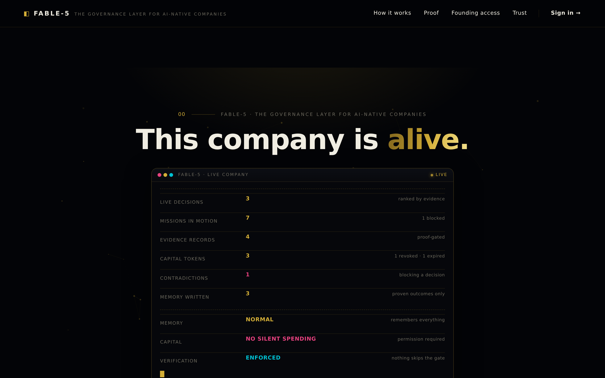
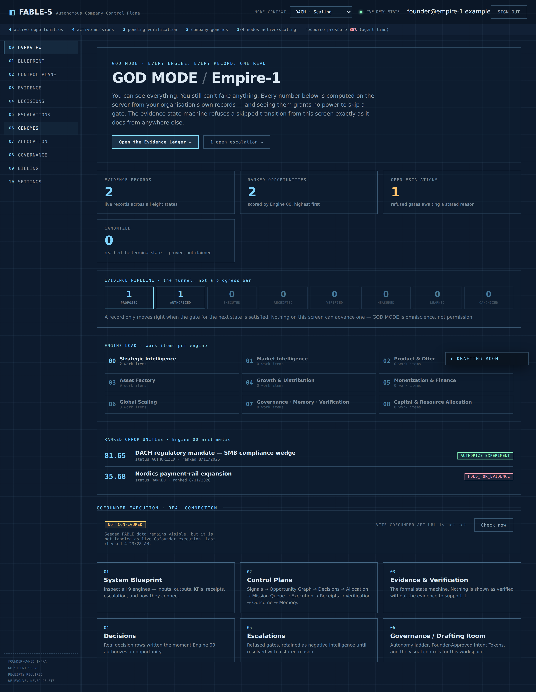
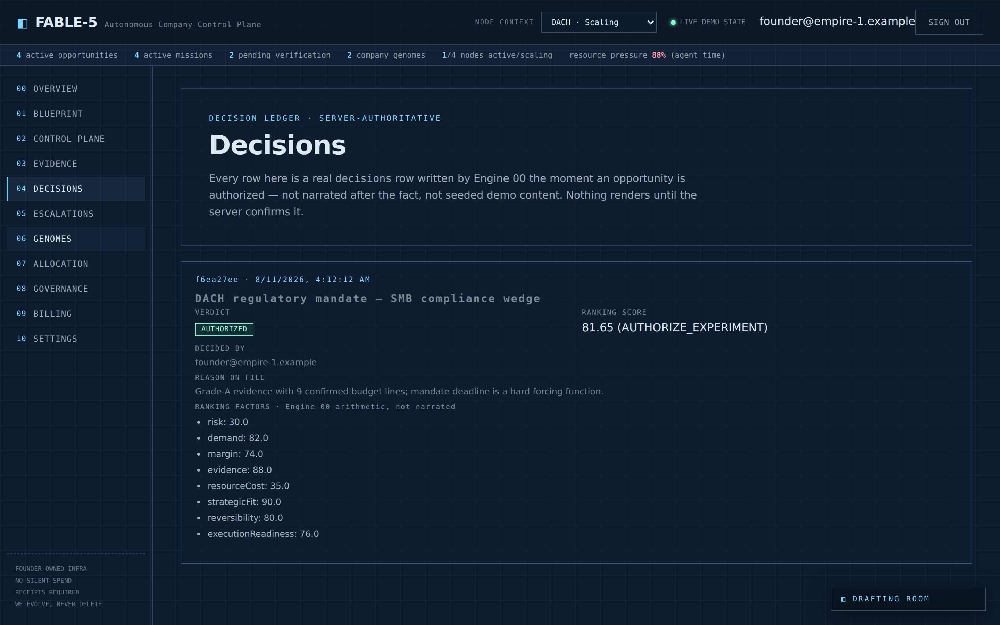
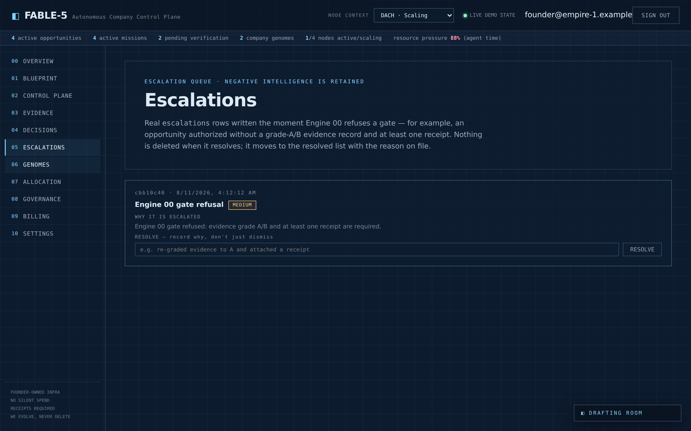
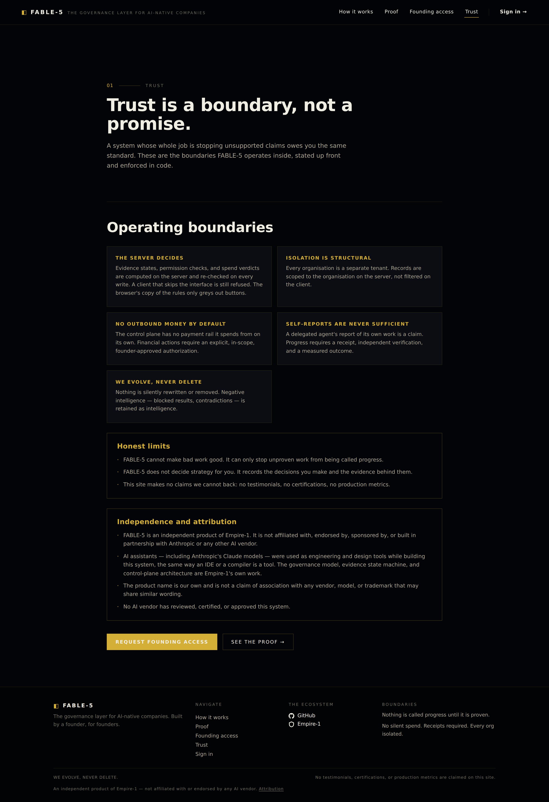

# FABLE-5 — The Governance Layer for AI-Native Companies



An evidence-governed control plane for AI-native companies, built by **Empire-1**.

The premise: autonomous agents produce output fast, and output is not progress.
FABLE-5 is the governance layer that sits *on top of* agents and decides what
counts as done — an evidence state machine where nothing advances without a
receipt, independent verification, and a measured outcome.

## Operating doctrine

- **Nothing is called progress until it is proven.** Evidence advances
  `PROPOSED → AUTHORIZED → EXECUTED → RECEIPTED → VERIFIED → MEASURED → LEARNED → CANONIZED`.
  Skipped gates are refused by the server, not just greyed out in the UI.
- **A delegated agent's self-report is never sufficient.** A claim of success
  requires a receipt and an independent check.
- **No silent spend.** Financial actions require an explicit, in-scope,
  founder-approved Intent Token. NO VALID TOKEN → NO SPEND.
- **We evolve, never delete.** Blocked results and contradictions are retained
  as negative intelligence, not erased.

## What it looks like

**GOD MODE** — the whole company in one server-computed read: every evidence state, all nine
engines, open escalations, and the ranked opportunity graph. You can see everything. You still
can't fake anything — the state machine refuses a skipped gate from this screen exactly as it
does from anywhere else. Omniscience, not permission.



**The decision ledger** — every row is a real `decisions` row written by Engine 00 the moment
an opportunity is authorized. The ranking score and factors are the server's own arithmetic,
not narrated after the fact.



**The escalation queue** — when Engine 00 refuses a gate (here: an opportunity pushed without
grade-A/B evidence and a receipt), the refusal is *persisted*, not swallowed. It stays on the
record until someone resolves it with a stated reason.



## Layout

| Directory | What it is |
|---|---|
| `scale-v2/` | The server-authoritative control plane: Express + PostgreSQL, tenant isolation via RLS, evidence/ranking/spend domain logic. **Current backend.** |
| `app/` | React + TypeScript + Vite frontend — public site and private control-plane workspaces. |
| `backend/` | Stripe billing BFF. |
| `site/` | Earlier static HTML implementation, kept per WE EVOLVE, NEVER DELETE. |

## Run it

```sh
# backend
cd scale-v2
cp .env.example .env          # set DATABASE_URL, admin bootstrap creds
npm install && npm run migrate && npm run bootstrap
npm start                     # :3001

# frontend
cd ../app
npm install
echo "VITE_API_BASE=http://127.0.0.1:3001" > .env.local
npm run dev
```

## Verify it

```sh
cd scale-v2 && npm test    # domain + integration tests against a real Postgres
cd app && npm test         # frontend unit tests
cd app && npm run build    # tsc + vite build
```

`scale-v2/PRODUCTION_GATE.md` lists every check that must capture a receipt
before this system may be called production-ready. It is deliberately not all
green.

---

## Independence and attribution



**FABLE-5 is an independent product of Empire-1.** It is not affiliated with,
endorsed by, sponsored by, or built in partnership with Anthropic or any other
AI vendor.

AI assistants — including Anthropic's Claude models — were used as engineering
and design tools while building this system, in the same way an IDE, a
compiler, or a linter is a tool. The governance model, evidence state machine,
and control-plane architecture are Empire-1's own work.

The product name is our own and is **not** a claim of association with any
vendor, model, or trademark that may share similar wording. No AI vendor has
reviewed, certified, or approved this system.
